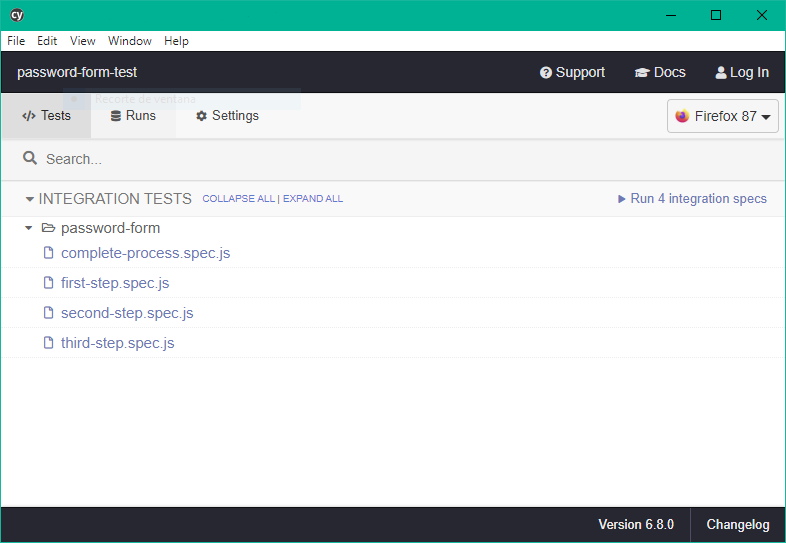

# Formulario para Password Manager

## Descripción

Aplicación desarrollada como prueba que consiste en un formulario para creación de contraseña en tres pasos:

1. Explicación y aceptación de condiciones
2. Introducción de contraseña y pista
3. Envío y feedback a la API

[Demo](https://password-form-test.netlify.app/)

## Aplicación

## Pre-requisitos

Se requiere tener instalado yarn o npm:

- [yarn](https://yarnpkg.com/)
- [npm](https://www.npmjs.com/get-npm)

## Iniciar aplicación

### Primera ejecución

Usa `yarn install` o `npm install` para instalar las dependencias del proyecto.
A continuación, usa `yarn start` o `npm start` para iniciar la ejecución y accede a la aplicación en [http://localhost:3000](http://localhost:3000).

La página se actualizará si se realiza cualquier modificación en el código.
También, se pueden ver posibles errores lint en la consola.

### Ejecución

Si todas las dependencias están instaladas y no se han realizado modificaciones de las mismas, basta con ejecutar `yarn start` o `npm start` para iniciar la aplicación.

## Pruebas unitarias

Se ha desarrollado test unitarios para algunos de los componentes; localizados en el mismo directorio que estos (ficheros `index.test.tsx`);

Para lanzarlos, ejecuta `yarn test` o `npm test` (es necesario haber instalado las dependencias del proyecto previamente). Al hacerlo se mostrarán tanto los casos exitosos como la tabla con la cobertura de código (esta última se genera en el directorio `coverage` de la raíz del proyecto).

En el fichero `package.json`, se ha configurado jest para permitir el uso de alias y hacer el coverage de los ficheros con extensión `.tsx`

```
  "jest": {
    "coveragePathIgnorePatterns": [
      "styles.ts",
      "types.ts",
      "theme.ts",
      "<rootDir>/src/screens/*"
    ],
    "moduleNameMapper": {
      "^@Components(.*)$": "<rootDir>/src/components$1",
      "^@Styles(.*)$": "<rootDir>/src/styles$1"
    }
  }
```

## Pruebas end-to-end

Para la elaboración de pruebas end-to-end se ha hecho uso de la librería `cypress`. Esta herramienta se encarga de abrir un navegador de pruebas en el que se accederá, de forma automática, a la web desarrollada y se ejecutarán los test elaborados.

Para iniciar la ejecución será necesario tener la aplicación iniciada. Hecho esto, ejecutando `yarn cypress` o `npm run cypress` se nos abrirá una interfaz con las pruebas disponibles:



Pulsando en uno de ellos, se abrirá una copia del navegador que tenemos por defecto en nuestro sistema operativo y se ejecutarán las pruebas:


_Se ha optado por la versión 4.10.1 por incompatibilidades entre babel y la última versión de cypress._

## Cobertura de código

Se han incluido varios scripts para generar la combinación de las coberturas de código generadas por jest y cypress.
Para la correcta obtención de la misma se requiren los siguientes pasos:

1. Lanzar tests unitarios con `yarn test` o `npm test`
2. Una vez lanzados, ejecutar uno de los siguientes scripts, para mover la cobertura de código generada por jest a un directorio temporal, en función de nuestro sistema operativo:
   - Linux: `yarn jest-cover-linux` o `npm run jest-cover-linux`
   - Windows: `yarn jest-cover-win` o `npm run jest-cover-win`
3. Ahora, ejecuta todos los test de cypress accediendo a la plataforma con `yarn cypress` o `npm run cypress` y pulsando en Run all specs.
4. Combinamos las coberturas de código, almacenadas actualmente en .nyc_output, con `yarn merge-cover` o `npm run merge-cover`. Esto generará un archivo coverage.json en el directorio ./coverage
5. Por último, ejecutamos `yarn report-cover` o `npm run report-cover` para crear el reporte con el formato válido en el directorio ./coverage/lcov-report. Podemos ver el resultado abriendo el archivo `index.html`, de dicho directorio, en nuestro navegador.


## Estructura del proyecto

    .
    ├── cypress                     # Configuración y pruebas de cypress
    │   └── integration             # Pruebas E2E
    │       └── password-form       # Listado de test desarrollados para la app
    ├── public
    │   └── locales                 # Traducciones
    ├── src                         # Contenido de nuestra aplicación
    │   ├── assets                  # Imágenes e iconos
    │   ├── components              # Componentes desarrollados
    │   │   └── ExampleComponent
    │   │       ├── index.test.tsx  # Tests
    │   │       ├── index.tsx       # Definición
    │   │       ├── logic.ts        # Algun tipo de lógica propia
    │   │       ├── styles.ts       # Estilos
    │   │       └── types.ts        # Tipos customizados
    │   ├── constants               # Constantes globales
    │   ├── router                  # Configuración de rutas
    │   ├── screens                 # Pantallas desarrolladas. Pueden contener componentes propios
    │   ├── services                # Configuración de servicios externos (api, i18n, ...)
    │   ├── store                   # Configuración de la store de redux
    │   │   ├── actions             # Listado de acciones
    │   │   ├── constants           # Constantes
    │   │   ├── reducers            # Manejadores de la store
    │   │   └── sagas               # Manejadores de los side effects
    │   ├── styles                  # Configuración del tema y estilos base
    │   ├── types                   # Tipos globales
    │   ├── index.css
    │   ├── index.tsx
    │   └── react-app-env.d.ts
    ├── .babelrc                    # Configuración de babel
    ├── .eslintignore
    ├── .eslintrc.js                # Configuración de la herramienta eslint
    ├── .gitignore
    ├── .prettierrc.js              # Configuración de Prettier
    ├── .rescriptsrc.js
    ├── package-lock.json
    ├── package.json
    ├── README.md
    ├── tsconfig.json
    ├── tsconfig.paths.json         # Listado de alias
    └── yarn.lock

## Alias

Se han configurado mediante la librería Babel distintos alias para simplificar las importaciones de los distintos elementos de la aplicación. Estos están alojados en los ficheros `.babelrc` y `.tsconfig.paths.json`.

Además, utilizamos la librería rescripts para facilitar el uso de dichos alias en la ejecución de nuestra app.

## Formato de código (Eslint + Prettier)

Se ha configurado la detección de errores de sintáxis mediante la librería eslint (la configuración se encuentra en el fichero `.eslintrc.js`), a fin de tener un código con más mantenibilidad y seguir un estándar de código limpio.

Además, se hace uso de la herramienta Prettier; de manera que, conectada con el IDE (en mi caso, VSCode), permite el formato automático del código siguiendo las siguientes propiedades:

```
  semi: true // Añade ';' al final de cada elemento
  trailingComma: 'all' // Añade ',' al final de los objetos (si es posible)
  singleQuote: true // Uso de comillas simples
  tabWidth: 2 // Indentación con dos espacios
```

## Redux-saga

Se ha optado por utilizar Redux para almacenar toda la información del formulario en la Store a fin de mantener centralizados los estados que se mueven por los distintos pasos del flujo.

Para simplificar su manejo y facilitar el manejo de los side effects o eventos secundarios, se ha decidido usar la librería `redux-saga`; la cuál proporciona una serie de métodos para ejecutar los eventos que modifican el estado actual de la store.

Cada vez que se llega a un nuevo paso del formulario, los estados se actualizan en la store; y una vez que el usuario llega al final y pulsa el botón, se vuelve al inicio y se resetean los valores (ocurre lo mismo si se actualiza la página). Si se require, es posible incluir un persistor de manera muy sencilla para que la Store conserve sus valores independientemente de si el usuario cierra la página o actualiza la misma.

## Dependencias

- [Babel](https://babeljs.io/): Compilador javascript
- [Cypress](https://www.cypress.io/): Librería de pruebas end-to-end
- [Eslint](https://eslint.org/): Herramienta para identificar y reportar patrones encontrados en el código ECMAScript/JavaScript
- [enzyme](https://enzymejs.github.io/enzyme/): Librería para ejecutar tests con jest en React
- [jest](https://jestjs.io/): Librería de test para JavaScript
- [Material UI](https://material-ui.com/): Librería de componentes front
- [Prettier](https://prettier.io/): Formateador de código
- [React](https://es.reactjs.org/): Librería para construir interfaces de usuario con JavaScript
- [React Hook Form](https://react-hook-form.com/): Librería de formularios para React
- [React router](https://reactrouter.com/): Manejador de rutas
- [Redux](https://es.redux.js.org/): Contenedor de estados
- [Redux-saga](https://redux-saga.js.org/): Librería de manejo de estados
- [React-i18next](https://react.i18next.com/): Plugin de internacionalización basado en i18next
- [Styled components](https://styled-components.com/): Uso de etiquetas de plantilla para estilar componentes
- [TypeScript](https://www.typescriptlang.org/)
- [Yup](https://github.com/jquense/yup): Librería para validación de formularios
